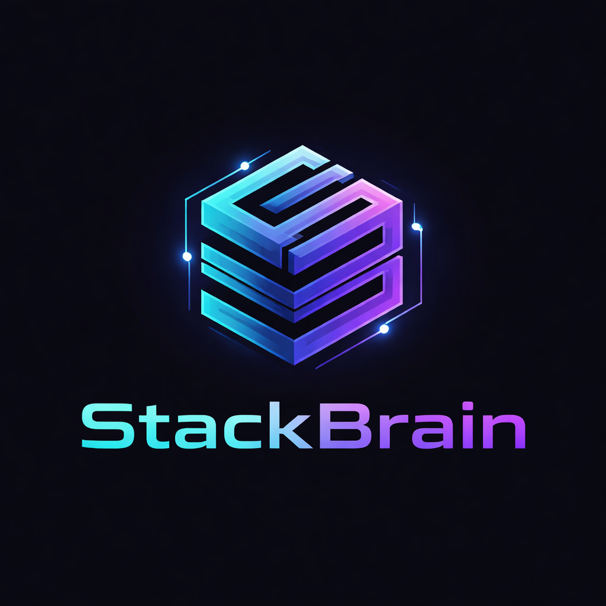

# StackBrain



Your AI principal engineer for architecture, systems, scaling, and hard technical decisions.

## What Is StackBrain?

StackBrain is a custom GPT built to help teams make real software engineering and architecture decisions.

It is designed for the questions that usually slow teams down:

- Which stack should we choose?
- Should we start with a modular monolith or microservices?
- What database fits our workload, constraints, and team?
- Where should service boundaries sit?
- How do we migrate safely without breaking production?
- Will this architecture still hold when usage grows 10x?

StackBrain does not give shallow or generic advice. It looks at your constraints, team size, product goals, scale expectations, and operational risk, then gives a recommendation it can defend. That includes trade-offs, failure modes, migration logic, risk exposure, and cost implications at scale.

## Open StackBrain

→ **[Launch StackBrain](https://chatgpt.com/g/g-69cf449d055c8191b286c602a019af85-stackbrain)**

Ask your question in plain language, and get a structured answer. No setup. No special syntax. No prompt engineering.

## Why StackBrain

Most architecture advice online is too broad to be useful. It sounds correct, but it is not specific enough to survive real constraints.

StackBrain is built differently. It is designed to think through decisions using:

- **Systems thinking** - how components interact, scale, fail, and evolve over time.
- **Security analysis** - trust boundaries, abuse paths, operational risks, and irreversible mistakes.
- **Compliance awareness** - privacy, regulatory pressure, data handling, and policy-sensitive design choices.
- **Decision discipline** - clear recommendations, explicit trade-offs, and direct rejection of weak options.

The goal is not to sound smart. The goal is to help you make a defensible decision.

## Features

- **Architecture guidance** - backend topology, frontend strategy, deployment models, and service boundaries.
- **Database selection** - compare relational, document, and cloud-native data models based on workload, consistency needs, team familiarity, and future scale.
- **Scale planning** - understand what works at launch, what breaks at 5x growth, and what changes at 20x.
- **Migration strategy** - plan safe transitions between stacks, auth models, databases, or architectures with rollback logic and downtime awareness.
- **Risk analysis** - see security, operational, and architectural risks before they become production problems.
- **Trade-off breakdowns** - get reasons for the recommended path and clear explanation of why alternatives are weaker.

## Clarifying Questions Only When Needed

When critical information is missing, StackBrain asks short, targeted questions that materially affect the recommendation. It only asks when the missing information would change the decision.

## What You Can Ask

Ask the way you would ask a senior engineer, architect, or technical advisor.

### Example Questions

- We're a 4-person team building a SaaS product. Should we start with a modular monolith or microservices?
- We need to choose a database for an e-commerce platform with flash sales. We're on AWS and the team already knows Postgres. What should we use?
- We're migrating from session-based auth to JWT on a live product with 50,000 daily users. What is the safest rollout path?
- Should we use GraphQL or REST? We have two frontend engineers, one backend engineer, and one shared API for mobile and web.
- What architecture should we use for one codebase that runs on iOS, Android, and web?
- We're building a fintech API with user accounts, transactions, audit logs, and analytics. What backend architecture fits best?

## What StackBrain Returns

Every answer is designed to help you decide, not just read. You get:

- A direct recommendation that is clear, specific, and stated plainly.
- The reasoning behind it, grounded in your context rather than generic best practice.
- Why other options are weaker, with honest comparisons and no fake balance.
- Trade-offs and failure modes so you know what you gain, what you give up, and where the design can break.
- Confidence level, including the conditions that would change the recommendation.
- Security and risk notes, especially for infrastructure, auth, data, and hard-to-reverse decisions.
- Migration guidance with step-by-step rollout paths, rollback thinking, and downtime risk when relevant.
- Scale implications so you know what the decision looks like at launch, 5x growth, and 20x growth.

### Example Output Structure

```
Recommendation
Start with a modular monolith using PostgreSQL and a queue-backed async worker layer.

Why
Your team is small, delivery speed matters, and your operational overhead budget is low. A modular monolith keeps coordination cost low while preserving clean boundaries for future extraction.

Why not the alternatives
Microservices add deployment, observability, and failure-mode complexity too early. DynamoDB increases operational fit only if your access patterns are already stable and your team is comfortable with single-table design.

Trade-offs
You gain speed, lower infra complexity, and easier local development. You accept that some future service extraction work may be needed if scaling or ownership boundaries become sharper.

Risks
Weak module boundaries can turn the monolith into a tightly coupled mess. Shared database access without discipline can make future decomposition expensive.

What changes the answer
The answer changes if multiple teams need independent deploy cycles or workload isolation/regulatory boundaries require hard separation.
```

## How StackBrain Handles Missing Context

If your question is missing critical information, StackBrain may ask a few short follow-up questions before answering. Typical gaps include team size, current stack, compliance requirements, scale expectations, budget constraints, delivery speed versus long-term maintainability, hosting environment, and operational maturity.

A fast wrong answer is worse than a short clarifying step.

## Best Use Cases

**Good fits:** greenfield product architecture, backend and frontend system design, database selection, service boundary definition, API design, auth and identity strategy, scaling strategy, infra planning, migration planning, platform architecture, risk and trade-off analysis, and technical decision pressure-testing.

**Weak fits:** simple documentation lookup, pure code generation, feature marketing copy, and lightweight bug fixes with no architectural dimension.

## What StackBrain Is Not

StackBrain is decision-focused and opinionated. It is not a search engine for summarizing docs, a generic chatbot that agrees with every idea, a full implementation engine for writing your entire codebase, or a replacement for engineering judgment. It is not a yes-machine; if your plan has a structural flaw, StackBrain is built to say so.

## FAQ

- **Do I need to use a special prompt format?** No. Ask naturally. Plain English works.
- **Can StackBrain help with early-stage ideas?** Yes, as long as the idea has a system, product, or technical decision layer that needs to be designed or stress-tested.
- **Does it only help software engineers?** No. It is strongest in software and systems decisions, but it can also help founders, technical leads, product builders, and teams evaluating how to structure a product or platform.
- **Will it ask follow-up questions every time?** No. It only asks when missing context would materially change the answer.
- **Can it help with migrations on live systems?** Yes. Migration planning is one of its strongest use cases, especially where downtime risk, rollback design, or security changes matter.
- **Can it compare multiple options?** Yes. It can compare stacks, databases, architectural styles, deployment models, and platform choices, then tell you which one best fits your context.
- **Does it consider security and compliance?** Yes. For decisions involving infrastructure, authentication, data storage, privacy, or regulated workflows, StackBrain includes security and compliance risk as part of the recommendation.

## Feedback

If StackBrain gives a weak answer, misses context, or fails on a real-world case, open an issue in this repository. The most useful feedback includes the exact question asked, the output received, what was wrong or missing, and what context should have changed the answer. Real examples improve the system fastest.

## Final Note

StackBrain is built to give the kind of answer a strong principal engineer would give: direct, structured, defensible, and grounded in trade-offs.
